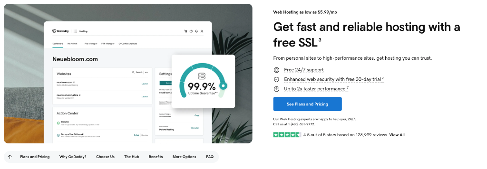

# 🚀 GoDaddy Deployment Guide - PureHearted Studioz

This comprehensive guide will walk you through deploying your PureHearted Studioz website to GoDaddy hosting.

---

## 📋 Table of Contents
1. [Prerequisites](#prerequisites)
2. [GoDaddy Hosting Plans](#godaddy-hosting-plans)
3. [Step-by-Step Deployment](#step-by-step-deployment)
4. [File Structure](#file-structure)
5. [Troubleshooting](#troubleshooting)
6. [Post-Deployment Checklist](#post-deployment-checklist)

---

## 📌 Prerequisites

Before you begin, make sure you have:
- ✅ A GoDaddy account
- ✅ An active GoDaddy Web Hosting plan
- ✅ Your domain name (if purchased)
- ✅ All website files ready for upload

---

## 💰 GoDaddy Hosting Plans

GoDaddy offers several hosting plans suitable for your website. Here are the recommended options:


### **Recommended Plans:**

#### **Web Hosting Economy** - $5.99/mo
- 1 website
- 25 GB NVMe storage
- cPanel
- Free domain
- Free email
- Free SSL Certificate (1 year)
- 30-day money-back guarantee
- Site security trial offer

#### **Hosting for WordPress Basic** - $5.99/mo ⭐ BEST FOR WORDPRESS
- 1 website
- 10 GB NVMe storage
- GoDaddy Managed Hosting for WordPress
- Free domain
- Free email
- Free SSL Certificate, no renewal fees
- 30-day money-back guarantee
- WordPress pre-installed
- Weekly backups

#### **Web Hosting Deluxe** - $7.99/mo (Recommended)
- 10 websites
- 50 GB NVMe storage
- cPanel
- Free domain
- Free email
- Free unlimited SSL for all websites
- 30-day money-back guarantee

---

## 🎯 Step-by-Step Deployment

### **Step 1: Access Your GoDaddy Hosting Dashboard**

1. Navigate to [GoDaddy](https://www.godaddy.com/)
2. Click **"Sign In"** in the top right corner
3. Enter your GoDaddy username and password
4. Go to **"My Products"**



As shown in the dashboard:
- You'll see your website listed (e.g., "Neuebloom.com")
- **Settings** section with options for:
  - **General** - Basic website settings
  - **Security** - SSL and security configurations
  - **Performance** - Speed and caching options
  - **Advanced** - Developer tools

---

### **Step 2: Access cPanel or File Manager**

**Option A: Via cPanel**
1. In "My Products", locate your Web Hosting
2. Click **"Manage"** or **"cPanel Admin"**
3. This opens your cPanel dashboard

**Option B: Via File Manager**
1. In your hosting dashboard, find **"File Manager"**
2. Click to open the file management interface

---

### **Step 3: Navigate to public_html Directory**

1. In File Manager or cPanel, locate the **`public_html`** folder
2. This is your website's root directory (where all files will be uploaded)
3. Delete any default files:
   - `index.html`
   - `coming-soon.html`
   - Any placeholder files

---

### **Step 4: Prepare Your Files**

**Files to Upload:**
```
✅ index.html
✅ style.css
✅ script.js
✅ All image files (.jpg, .png)
✅ assets/ folder (if applicable)
✅ public/ folder (if applicable)
```

**Files to EXCLUDE (Do NOT upload):**
```
❌ .git/ folder
❌ .env file
❌ node_modules/ folder
❌ server.js
❌ package.json
❌ *.py files
❌ *.md files (README, guides)
❌ .gitignore
```

---

### **Step 5: Upload Files to GoDaddy**

#### **Method A: Using File Manager (Easiest)**

1. Click the **"Upload"** button in File Manager
2. Drag and drop or select files:
   - `index.html`
   - `style.css`
   - `script.js`
   - All image files
3. Upload folders:
   - Right-click → Create folder → Name it (e.g., `assets`)
   - Or upload folders directly if supported
4. Wait for upload to complete (progress bar will show)

#### **Method B: Using FTP Client (FileZilla)**

1. **Download FileZilla Client** (free): https://filezilla-project.org/

2. **Get FTP Credentials from GoDaddy:**
   - In cPanel, go to **"FTP Accounts"**
   - Create a new FTP account or use existing credentials
   - Note down:
     - **Host:** `ftp.yourdomain.com` or IP address
     - **Username:** Your FTP username
     - **Password:** Your FTP password
     - **Port:** 21

3. **Connect via FileZilla:**
   - Open FileZilla
   - Enter Host, Username, Password, Port
   - Click **"Quickconnect"**

4. **Upload Files:**
   - Left side: Your local computer files
   - Right side: GoDaddy server (navigate to `public_html`)
   - Drag files from left to right to upload

---

### **Step 6: Verify File Structure**

After uploading, your `public_html` folder should look like this:

```
public_html/
├── index.html
├── style.css
├── script.js
├── assets/
│   └── (additional assets if any)
├── public/
│   └── (public files if any)
├── hero_bg.jpg
├── hero_bg.png
├── box_braids.jpg
├── box_braids.png
├── knotless_braids.jpg
├── knotless_braids.png
├── retwist_locs.jpg
├── retwist_locs.png
├── cornrows.jpg
├── cornrows_design.jpg
├── 2_strand_twist.jpg
├── hair_consultation.jpg
├── long_braids.jpg
├── medium_braids.jpg
├── short_braids.jpg
├── short_braids_2.jpg
├── single_braids.jpg
├── starter_locs.jpg
├── straight_back.jpg
├── stylist_photo.jpg
├── twist.jpg
├── twists.jpg
├── meet_stylist.png
└── side_barrels.png
```

---

### **Step 7: Configure Domain Settings**

1. **Point Domain to Hosting:**
   - If you purchased a domain through GoDaddy, it should already be pointed to your hosting
   - Verify in **"Domains"** → **"DNS"** settings

2. **Set Primary Domain:**
   - In cPanel, go to **"Addon Domains"** or **"Primary Domain"**
   - Ensure your domain points to the `public_html` folder

---

### **Step 8: Enable SSL Certificate (HTTPS)**

As shown in the dashboard, GoDaddy offers **free SSL** with most plans:

1. In your hosting dashboard, go to **"Security"** section
2. Find **"SSL Certificate"**
3. Click **"Set Up"** or **"Manage"**
4. Enable SSL for your domain
5. Wait 5-10 minutes for SSL to activate
6. Your site will be accessible via `https://yourdomain.com`

**Benefits of SSL:**
- ✅ Enhanced web security
- ✅ Free 30-day trial (or included free)
- ✅ 99.9% uptime guarantee
- ✅ Better SEO ranking
- ✅ Customer trust

---

### **Step 9: Test Your Website**

1. Open your web browser
2. Navigate to: `http://yourdomain.com` or `https://yourdomain.com`
3. Verify:
   - ✅ Website loads correctly
   - ✅ All images display
   - ✅ CSS styling appears
   - ✅ JavaScript functions work (booking forms, interactions)
   - ✅ All pages are accessible

---

### **Step 10: Clear Cache (If Needed)**

If you see old content or the site doesn't look right:

**Clear Browser Cache:**
- **Windows/Linux:** `Ctrl + Shift + R` or `Ctrl + F5`
- **Mac:** `Cmd + Shift + R`

**Clear GoDaddy Server Cache:**
- In cPanel, look for **"Performance"** or **"Cache Manager"**
- Clear server cache if available

---

## 📁 File Structure

### **Important File Paths**

Make sure your HTML references files correctly:

**✅ Correct Relative Paths:**
```html
<link rel="stylesheet" href="./style.css">
<script src="./script.js"></script>


```

**❌ Avoid Absolute Paths:**
```html
<!-- Don't use localhost -->
<link rel="stylesheet" href="http://localhost:8000/style.css">

<!-- Don't use hardcoded full paths -->

```

---

## 🔧 Troubleshooting

### **Problem: Website Shows "Coming Soon" or Default Page**

**Solution:**
- Delete default `index.html` in `public_html`
- Ensure your `index.html` is directly in `public_html` (not in a subfolder)
- Clear browser cache

---

### **Problem: Images Not Loading**

**Solution:**
- Check file names match exactly (case-sensitive on Linux servers)
- Example: `Hero_Bg.jpg` ≠ `hero_bg.jpg`
- Verify image files are in the correct directory
- Check HTML image paths are relative (e.g., `./image.jpg`)

---

### **Problem: CSS Not Applied**

**Solution:**
- Verify `style.css` is in `public_html`
- Check `<link>` tag in `index.html`:
  ```html
  <link rel="stylesheet" href="./style.css">
  ```
- Clear browser cache
- Check for typos in file name

---

### **Problem: JavaScript Not Working**

**Solution:**
- Verify `script.js` is uploaded
- Check console for errors (F12 → Console tab)
- Ensure `<script>` tag is correct:
  ```html
  <script src="./script.js"></script>
  ```
- Make sure script is loaded before closing `</body>` tag

---

### **Problem: Website Not Loading (404 Error)**

**Solution:**
- Verify domain is pointed to hosting
- Check DNS settings in GoDaddy dashboard
- Wait 24-48 hours for DNS propagation (if domain is new)
- Contact GoDaddy support: **1-480-463-8777**

---

### **Problem: SSL Not Working**

**Solution:**
- Wait 10-15 minutes after enabling SSL
- Force HTTPS redirect in `.htaccess`:
  ```apache
  RewriteEngine On
  RewriteCond %{HTTPS} off
  RewriteRule ^(.*)$ https://%{HTTP_HOST}%{REQUEST_URI} [L,R=301]
  ```
- Clear browser cache
- Contact GoDaddy support for SSL issues

---

## ✅ Post-Deployment Checklist

After deployment, verify:

- [ ] Website loads at your domain (`yourdomain.com`)
- [ ] HTTPS/SSL is active (green padlock in browser)
- [ ] All images display correctly
- [ ] CSS styling appears as expected
- [ ] JavaScript functions work (forms, interactions)
- [ ] Mobile responsive design works
- [ ] All internal links work
- [ ] Contact forms submit properly
- [ ] Booking system functions (if applicable)
- [ ] Footer information is correct
- [ ] Social media links work
- [ ] Google Analytics added (if applicable)

---

## 📞 GoDaddy Support

If you need help:

- **Phone:** 1-480-463-8777
- **Live Chat:** Available in your account dashboard
- **Help Center:** https://www.godaddy.com/help
- **24/7 Support:** Free with most hosting plans

---

## 🎉 Success Metrics

Your website is live! Monitor these metrics:

- **Uptime:** 99.9% guaranteed by GoDaddy
- **Performance:** Check with GTmetrix or Google PageSpeed
- **Website Traffic:** Use Google Analytics
- **Load Time:** Should be under 3 seconds

---

## 📚 Additional Resources

- [GoDaddy Knowledge Base](https://www.godaddy.com/help)
- [cPanel Documentation](https://docs.cpanel.net/)
- [FileZilla FTP Tutorial](https://wiki.filezilla-project.org/FileZilla_Client_Tutorial)
- [SSL Certificate Setup Guide](https://www.godaddy.com/help/install-an-ssl-certificate-16623)

---

## 🔄 Updates and Maintenance

**To Update Your Website Later:**

1. Make changes to your local files
2. Test locally (http://localhost:8000)
3. Upload updated files via FTP or File Manager
4. Replace existing files on GoDaddy
5. Clear cache and test live site

**Best Practices:**
- Keep local backups of all files
- Version control with Git
- Test changes locally before uploading
- Use FTP client for faster updates

---

## 📝 Notes

- First-time DNS propagation can take 24-48 hours
- SSL activation typically takes 5-15 minutes
- File uploads may take longer for large images
- Always backup files before making changes

---

**Deployment Date:** 2025-12-29  
**Website:** PureHearted Studioz  
**Platform:** GoDaddy Web Hosting

---

*For questions or issues, refer to the [Troubleshooting](#troubleshooting) section or contact GoDaddy support.*
