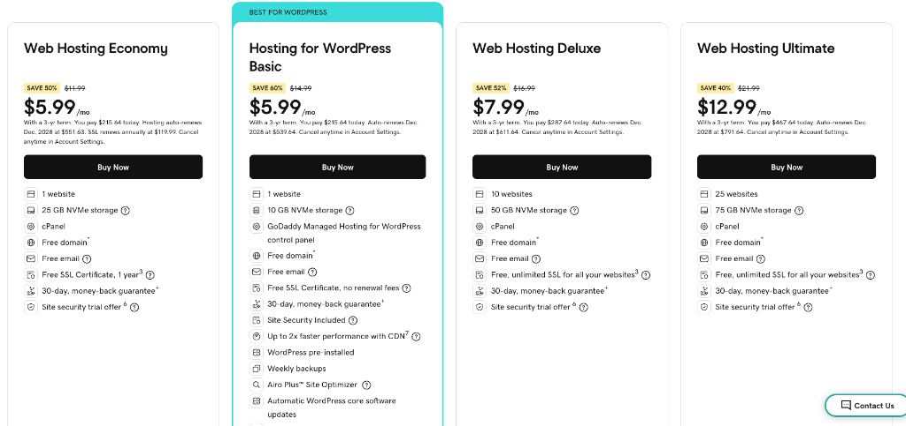

# 🚀 GoDaddy Deployment - Quick Start Guide

**PureHearted Studioz Website Deployment**

---

## ⚡ Quick Steps (5 Minutes)

### 1️⃣ **Login to GoDaddy**
- Go to [godaddy.com](https://www.godaddy.com)
- Sign In → My Products → Find your Web Hosting
- Click **"Manage"** or **"cPanel Admin"**

### 2️⃣ **Access File Manager**
- Click **"File Manager"** in cPanel
- Navigate to **`public_html`** folder
- Delete any default files (index.html, coming-soon.html)

### 3️⃣ **Upload Files** ⬆️
Click **"Upload"** button and upload:
```
✅ index.html
✅ style.css
✅ script.js
✅ All .jpg and .png images
✅ assets/ folder (if any)
✅ public/ folder (if any)
```

**DON'T Upload:**
```
❌ .git/ folder
❌ .env file
❌ server.js
❌ package.json
❌ node_modules/
```

### 4️⃣ **Enable SSL** 🔒
- Dashboard → **"Security"** section
- Find **"SSL Certificate"**
- Click **"Set Up"** or enable SSL
- Wait 5-10 minutes for activation

### 5️⃣ **Test Your Site** ✅
- Visit: `https://yourdomain.com`
- Check images, CSS, and JavaScript work
- Clear cache if needed: `Ctrl + Shift + R` (Win) or `Cmd + Shift + R` (Mac)

---

## 📁 Your File Structure Should Look Like:

```
public_html/
├── index.html          ← Main page
├── style.css           ← Styles
├── script.js           ← JavaScript
├── hero_bg.jpg         ← Images
├── box_braids.jpg
├── knotless_braids.jpg
├── meet_stylist.png
└── (all other images)
```

---

## 🔧 Common Fixes

| Problem | Solution |
|---------|----------|
| **Site shows "Coming Soon"** | Delete default index.html, upload yours |
| **Images not loading** | Check file names match exactly (case-sensitive) |
| **CSS not working** | Verify `style.css` is uploaded, clear cache |
| **JavaScript broken** | Check `script.js` is uploaded, check console (F12) |
| **404 Error** | Wait 24-48hrs for DNS, check domain settings |

---

## 💰 Recommended Hosting Plan

**Web Hosting Deluxe - $7.99/mo**
- 10 websites
- 50 GB storage
- Free SSL
- Free domain
- cPanel access



---

## 📞 Need Help?

- **GoDaddy Support:** 1-480-463-8777 (24/7)
- **Live Chat:** Available in account dashboard
- **Full Guide:** See `GODADDY_DEPLOYMENT_GUIDE.md`

---

## ✅ Post-Deployment Checklist

- [ ] Website loads at your domain
- [ ] HTTPS (green padlock) is active
- [ ] All images display
- [ ] CSS styling works
- [ ] JavaScript functions properly
- [ ] Mobile view works
- [ ] Contact/booking forms work

---

## 🎯 FTP Method (Alternative)

**Using FileZilla:**

1. Download [FileZilla](https://filezilla-project.org/)
2. Get FTP credentials from cPanel → "FTP Accounts"
3. Connect:
   - **Host:** `ftp.yourdomain.com`
   - **Username:** Your FTP username
   - **Password:** Your FTP password
   - **Port:** 21
4. Drag files from left (local) to right (server)
5. Upload to `public_html` folder

---

## 🔄 Future Updates

To update your site later:
1. Edit files locally
2. Test at `http://localhost:8000`
3. Upload changed files via FTP or File Manager
4. Clear cache and verify changes

---

**Deployment Date:** 2025-12-29  
**Estimated Time:** 5-10 minutes  
**Difficulty:** ⭐⭐☆☆☆ (Easy)

*For detailed instructions, see the full [GoDaddy Deployment Guide](GODADDY_DEPLOYMENT_GUIDE.md)*
